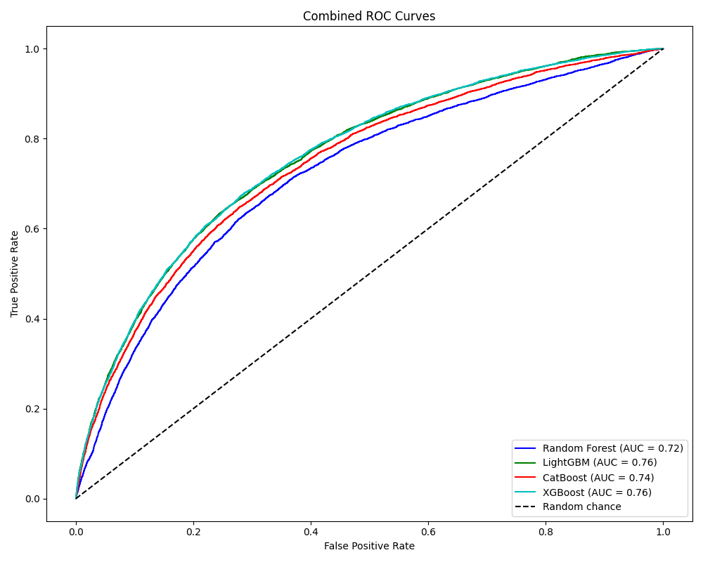
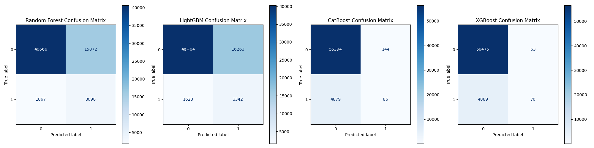

Сравнение метрик моделей

|               | На кроссвалидации | На отложенной выборке | На кеггле |
|---------------|------------------|-----------------------|-----------|
| Random Forest | 0.715730         | 0.720386894           | 0.70867   | 
| Catboost      | 0.739089         | 0.744123434           | 0.73177   |
| LightGBM      | 0.749596         | 0.759575595           | 0.75113   | 
| XGBoost       | 0.750332         | 0.760497699           | 0.75218   |

Хуже всего отработал случайный лес, но вероятно это из-за маленького количества параметров на гридсерче, очень долго выполняется у меня на ноутбуке, поэтому так. Быстрее всего отработал LightGBM и показал хорошие результаты. Еще хочется отметить optuna для поиска параметров - очень быстро и хорошо отработало.

